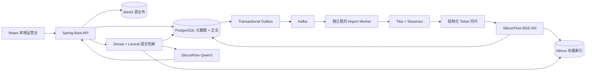

# MyRAG

MyRAG 是一个面向企业知识运营的 AI 知识库，依据简历中“AI 知识库”项目经历实现。系统覆盖多格式批量导入、结构化解析、知识审核、混合检索、RAG 问答、质量指标和 Bad Case 追溯。

仓库同时提供两种运行形态：

- 开发演示：H2、本地内容寻址存储、Hash Embedding、进程内向量检索，零外部服务即可运行。
- 完整拓扑：PostgreSQL、Kafka、MinIO、Milvus、独立 API/Worker 与 SiliconFlow Chat/Embedding，使用 Outbox、任务租约和可恢复 Worker。

## 已实现能力

- 知识状态机：草稿、提交审核、通过、驳回、下线、重新提交和乐观锁版本控制。
- 批量导入：Word、PDF、Excel、PowerPoint、CSV、TXT、Markdown、RTF 和常见图片。
- OCR：Docker 镜像内置 Tesseract `chi_sim+eng`，支持图片和扫描版 PDF。
- 结构化解析：保留标题层级、段落、列表、表格行、页码与定位信息。
- Token 切片：目标 480 Token、60 Token 重叠，超长块拆分，Chunk 内容哈希稳定。
- 可靠任务：导入批次与 Outbox 同事务写入，Kafka 至少一次投递，原子文件领取、持续租约心跳、退避重试和兜底扫描。
- 恢复与幂等：进程中断阶段自动重新排队，超过恢复上限自动失败；`import_task_id` 唯一约束保证重复消息和索引后崩溃不会生成重复知识。
- 轻量存储：MinIO 原文件按 SHA-256 内容寻址去重；Milvus 只保存向量和过滤字段，不重复保存正文。
- 混合召回：Milvus HNSW/COSINE 稠密召回 + PostgreSQL `pg_trgm` 词法召回 + Java 重排。
- 生成式 RAG：受控上下文 Prompt、Prompt Injection 防护、强制来源标记、引用一致性校验、重试和抽取式降级。
- 本地边界：无登录单用户模式，前端仅绑定回环地址，并保留变更审计与容器隔离。
- 文件防护：格式/MIME/大小/字符上限、解析硬超时、API 与解析 Worker 进程隔离。
- 索引治理：PostgreSQL/Milvus 内容哈希、状态和孤儿向量定时对账修复。
- 质量闭环：回答置信度、时延、采纳率、Bad Case 原因和来源快照。
- 运营界面：知识领域/状态筛选、真实分页与总数、编辑和状态操作；看板展示真实周环比、P95、最久待审和处理中批次。
- 可观测性：Actuator、Prometheus 指标、生产就绪检查和受限容器日志。
- 自动化验收：Vitest 覆盖指标与知识管理交互，Playwright 覆盖创建、审核、问答和负反馈闭环。

## 生产数据流



## 技术栈

- 后端：Java 21、Spring Boot 4.1、Spring Data JPA、Flyway、Micrometer
- 任务：Kafka、Transactional Outbox、数据库租约 Worker
- 存储：PostgreSQL 17、MinIO、Milvus 2.6、etcd
- 解析：Apache Tika 3.3、PDFBox、Apache POI、Tesseract OCR
- 前端：React 19、TypeScript、Vite、Nginx
- 交付：Docker Compose、Maven、pnpm、Testcontainers、GitHub Actions、CodeQL

## 快速启动

### 零依赖开发演示

```bash
docker compose up --build -d
```

访问 [http://localhost:3000](http://localhost:3000)。此模式用于功能演示，不使用 Kafka、Milvus、MinIO。

### Kafka + Milvus + MinIO 生产拓扑

先创建 SiliconFlow API Key。完整 Compose 默认调用 SiliconFlow 的 `Qwen/Qwen3-8B` 与 `BAAI/bge-m3`，不会下载本地模型。

```bash
cp .env.example .env
# 修改 .env 中的密码和 SILICONFLOW_API_KEY
docker compose --env-file .env -f docker-compose.production.yml up --build -d
docker compose --env-file .env -f docker-compose.production.yml ps
curl http://localhost:3000/actuator/health/liveness
curl http://localhost:3000/actuator/health/readiness
```

服务入口：

- 管理端：[http://localhost:3000](http://localhost:3000)
- MinIO Console：[http://localhost:9001](http://localhost:9001)
- Milvus：`localhost:19530`

`docker-compose.production.yml` 是资源受限电脑上的单节点完整拓扑验证基线，不等同于高可用生产集群。当前为无登录的单用户本地模式，只允许通过本机回环地址访问；文件导入通过白名单、MIME、容量、正文质量和解析超时等轻量措施控制风险。

## 本地开发与验证

```bash
# 终端 1，需要 JDK 21
make dev-backend

# 终端 2，需要 Node.js 22 与 pnpm
make dev-frontend

# 后端测试 + 前端单元测试 + 严格构建
make test

# Chromium 端到端知识闭环
make test-e2e
```

本机若默认仍是 JDK 8，请显式设置：

```bash
export JAVA_HOME=/opt/homebrew/opt/openjdk@21/libexec/openjdk.jdk/Contents/Home
export PATH="/opt/homebrew/opt/maven/bin:$JAVA_HOME/bin:$PATH"
```

## 生产轻量化策略

- 原文件以 SHA-256 为对象键，相同内容只在 MinIO 保存一份。
- Milvus 不存 Chunk 正文；正文和元数据仅保存在 PostgreSQL。
- Kafka 单机验证环境保留 24 小时、最大约 512 MB 日志。
- Outbox 已发布事件默认保留 7 天并自动清理。
- Docker 日志单容器最多 `3 × 10 MB`。
- Embedding 使用远程 API，避免本机模型权重与推理运行时占用磁盘。
- Chat Completion 与 Embedding 共用 SiliconFlow API Key；失败时自动退回带来源的抽取式答案。
- 前端只绑定 `127.0.0.1:3000`，不提供登录、用户或角色功能，不应暴露到公网或局域网。
- API 与 Worker 共用一个镜像但独立进程，API 不执行解析，Worker 不开放 HTTP 端口。
- PostgreSQL 用 Flyway 管理 Schema，Milvus 使用 HNSW + mmap，索引可按文档重建。

详细部署和容量建议见 [生产部署](docs/PRODUCTION_DEPLOYMENT.md)，当前电脑评估见 [环境评估](docs/ENVIRONMENT_ASSESSMENT.md)。

## 核心 API

| 模块 | 方法 | 接口 | 说明 |
| --- | --- | --- | --- |
| 知识 | GET | `/api/knowledge` | 搜索和分页 |
| 知识 | GET | `/api/knowledge/domains` | 获取真实业务领域筛选项 |
| 知识 | POST | `/api/knowledge` | 新建草稿并索引 |
| 审核 | POST | `/api/knowledge/{id}/submit` | 提交审核 |
| 审核 | POST | `/api/knowledge/{id}/review` | 通过或驳回 |
| 导入 | POST | `/api/imports` | 创建多文件导入批次 |
| 导入 | GET | `/api/imports/{batchId}` | 查询逐文件进度 |
| 导入 | POST | `/api/imports/{batchId}/retry` | 重试失败文件 |
| 导入 | POST | `/api/imports/{batchId}/submit` | 批量提交审核 |
| 问答 | POST | `/api/qa/ask` | 执行 RAG 问答 |
| 反馈 | POST | `/api/qa/{traceId}/feedback` | 采纳或标记 Bad Case |
| 分析 | GET | `/api/analytics/overview` | 质量看板指标 |

## 文档

- [系统架构](docs/ARCHITECTURE.md)
- [批量导入全流程](docs/IMPORT_PIPELINE.md)
- [生产部署与运维](docs/PRODUCTION_DEPLOYMENT.md)
- [本地运行与文件安全](docs/SECURITY.md)
- [RAG 生成与索引治理](docs/RAG_PRODUCTION.md)
- [当前电脑环境评估](docs/ENVIRONMENT_ASSESSMENT.md)

## 许可

[MIT](LICENSE)
