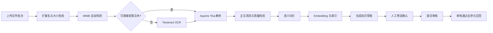

# MyRAG

一个面向企业知识运营场景的 AI 知识库项目，依据简历中“荣耀 AI 知识库”项目经历还原实现。项目覆盖知识集成、审核、状态维护、批量导入导出、RAG 问答、质量可视化和 Bad Case 追溯。

本项目默认使用本地确定性 Embedding 与基于检索结果的回答生成器，不需要 API Key 即可完整演示。`EmbeddingService` 和回答生成层均可替换为生产环境中的 Milvus、Embedding 模型与 LLM。

## 功能

- 知识管理：草稿、提交审核、通过、驳回、下线、重新提交与版本控制
- 多格式批量导入：Word、PDF、Excel、PowerPoint、CSV、TXT、Markdown、RTF 和常见图片
- OCR：容器内置 Tesseract 中文简体与英文语言包，支持图片和扫描版 PDF
- 导入任务：批次/文件双层状态、逐阶段进度、独立失败、重试、预览、提交审核、结果报告
- RAG：文档切片、向量化、领域过滤、Top-K 召回、答案引用和 Trace ID
- 问答质量：采纳率、置信度、响应时延、趋势与领域覆盖统计
- Bad Case：低置信度和负反馈自动入池，保留回答、原因与召回快照
- 管理端：运营概览、知识管理、批量导入、审核、问答调试与追溯工作台

## 技术栈

- 后端：Java 21、Spring Boot 4.1、Spring Data JPA、Hibernate 7、H2、Apache Tika 3.3
- 前端：React 19、TypeScript 7、Vite 8、Lucide
- 文档解析：Apache Tika、PDFBox、Apache POI、Tesseract OCR
- 交付：Docker Compose、Nginx、Maven、pnpm

## 快速启动

推荐使用 Docker，运行环境会自动包含 OCR 组件：

```bash
docker compose up --build
```

浏览器访问 [http://localhost:3000](http://localhost:3000)。首次启动会写入演示知识和问答质量数据，持久化内容保存在 Docker Volume `myrag-data`。

本地开发：

```bash
# 终端 1（需要 JDK 21）
make dev-backend

# 终端 2（需要 Node.js 22 和 pnpm）
cd frontend && pnpm install && pnpm dev
```

前端访问 `http://localhost:5173`，后端 API 为 `http://localhost:8080`。

## 验证

```bash
make test
```

测试覆盖知识审核和问答反馈主链路、异步批量导入，以及 Word、PDF、Excel 的真实文本解析。前端通过 TypeScript 严格模式和生产构建校验。

## 多格式导入流程



详细设计见 [批量导入设计](docs/IMPORT_PIPELINE.md) 和 [系统架构](docs/ARCHITECTURE.md)。

## 核心 API

| 模块 | 方法 | 接口 | 说明 |
| --- | --- | --- | --- |
| 知识 | GET | `/api/knowledge` | 搜索和分页 |
| 知识 | POST | `/api/knowledge` | 新建草稿 |
| 审核 | POST | `/api/knowledge/{id}/submit` | 提交审核 |
| 审核 | POST | `/api/knowledge/{id}/review` | 通过或驳回 |
| 导入 | POST | `/api/imports` | 创建多文件导入批次 |
| 导入 | GET | `/api/imports/{batchId}` | 查询逐文件进度 |
| 导入 | POST | `/api/imports/{batchId}/retry` | 重试失败文件 |
| 导入 | POST | `/api/imports/{batchId}/submit` | 批量提交审核 |
| 问答 | POST | `/api/qa/ask` | 执行 RAG 问答 |
| 反馈 | POST | `/api/qa/{traceId}/feedback` | 采纳或标记 Bad Case |
| 分析 | GET | `/api/analytics/overview` | 质量看板指标 |

## 生产化演进

当前仓库优先保证零外部依赖的可运行演示。面向千万级知识，建议按以下边界替换：

1. H2 替换为 MySQL/PostgreSQL，原始文件写入 S3/OBS 等对象存储。
2. `ImportProcessor` 的本地线程池替换为 RocketMQ/Kafka 消费者，并加入任务租约和幂等键。
3. `HashEmbeddingService` 替换为 Embedding 服务，`KnowledgeChunkRepository` 替换为 Milvus 检索适配器。
4. 回答生成器接入实际 LLM，并加入 Prompt 版本、敏感信息过滤、引用一致性检查和 Token 成本统计。
5. 增加 SSO/RBAC、操作审计、病毒扫描、文件沙箱、指标监控和告警。

## 许可

[MIT](LICENSE)
