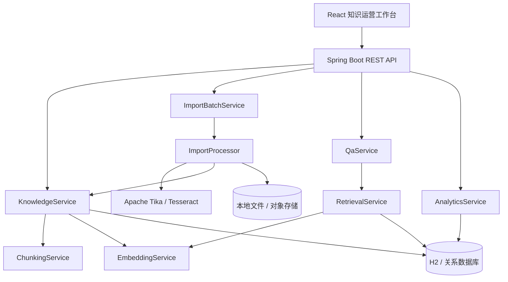
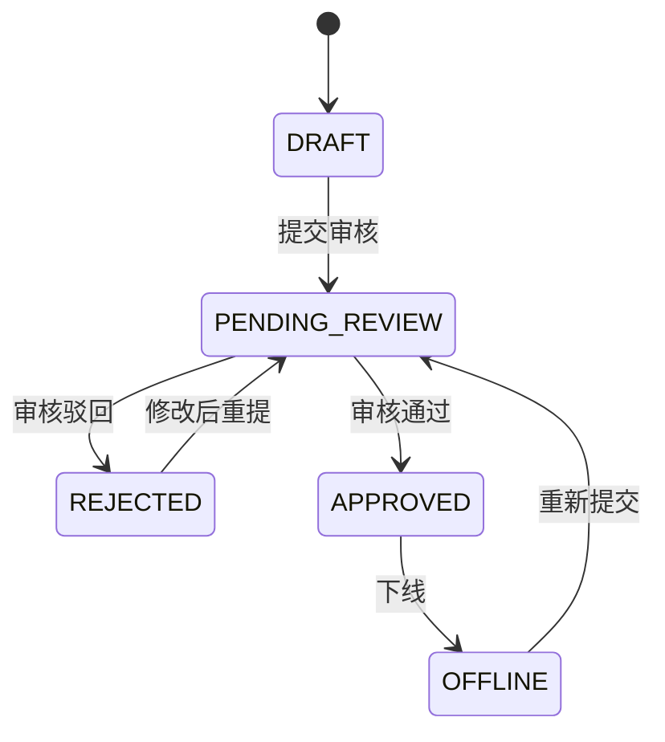

# 系统架构

## 组件关系

## 领域模型

- `KnowledgeDocument`：知识元数据、正文、审核状态、版本和切片数。
- `KnowledgeChunk`：文档切片及序列化向量。
- `ImportBatch`：一次多文件导入的总体进度和结果。
- `ImportFileTask`：单文件处理阶段、MIME、错误和目标知识 ID。
- `QuestionLog`：问题、回答、置信度、延迟、反馈、Bad Case 原因和来源快照。

## 知识状态机

只有 `APPROVED` 知识参与问答召回。

## 可替换边界

| 当前实现 | 抽象边界 | 生产替换 |
| --- | --- | --- |
| H2 | JPA Repository | MySQL / PostgreSQL |
| 本地目录 | `storedPath` 与存储服务边界 | S3 / OBS / MinIO |
| 本地线程池 | `ImportProcessor` | RocketMQ / Kafka Worker |
| Hash Embedding | `EmbeddingService` | BGE / OpenAI Compatible Embedding |
| JPA 向量扫描 | `RetrievalService` | Milvus / pgvector / Elasticsearch |
| 抽取式回答 | `QaService` 回答构造边界 | LLM + Prompt 模板与护栏 |

## 质量指标口径

- 采纳率：有明确反馈的问答中 `accepted=true` 的比例。
- 平均置信度：召回最高分映射后的回答置信度均值。
- Bad Case：无召回、低置信度或用户负反馈的问答。
- 响应时间：从接收问题到持久化回答结果的服务端耗时。
- 领域覆盖：按知识 `domain` 聚合的文档数量。
