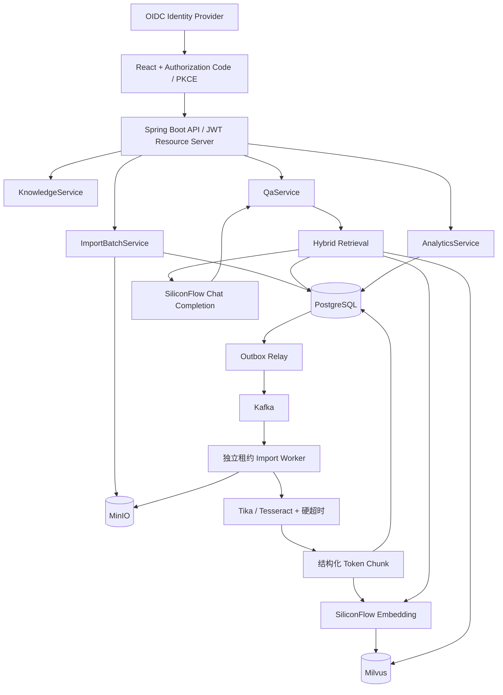
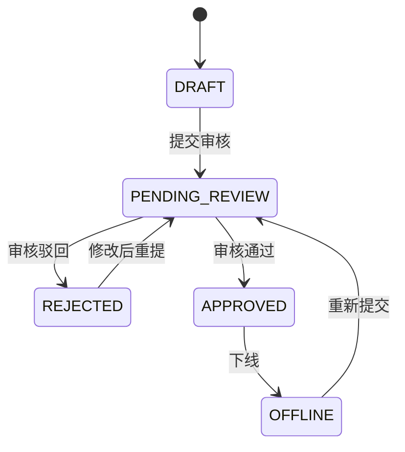

# 系统架构

## 生产组件关系

## 组件职责与存储边界

| 组件 | 保存内容 | 不保存内容 | 设计原因 |
| --- | --- | --- | --- |
| MinIO | 原始文件，以 SHA-256 内容寻址 | Chunk、向量 | 相同文件物理去重，可独立做生命周期和备份 |
| PostgreSQL | 文档、Chunk 正文、状态、任务、Outbox、问答日志 | 稠密向量 | 强事务和管理查询；`pg_trgm` 提供轻量词法召回 |
| Kafka | 导入批次 ID 事件 | 原文件、解析正文 | 消息小、可重放，不重复保存大内容 |
| Milvus | `chunk_id`、`document_id`、领域、状态、内容哈希、向量 | Chunk 正文 | 避免正文双份存储，结果回 PostgreSQL 补全 |
| etcd | Milvus 元数据 | 业务数据 | 由 Milvus 管理 |

## 领域模型

- `KnowledgeDocument`：知识正文、领域、来源、审核状态、索引版本和源文件哈希。
- `KnowledgeChunk`：Chunk 正文、页码、标题路径、定位符、Token 数、内容哈希和 Embedding 模型。
- `ImportBatch`：批次进度、领取 Worker、租约、下次重试时间和失败原因。
- `ImportFileTask`：对象键、文件哈希、MIME、处理阶段、目标知识 ID 和错误。
- `OutboxEvent`：待投递 Kafka 的事件、投递租约、退避时间和保留状态。
- `QuestionLog`：问题、回答、模型、Prompt 版本、Token 用量、降级标记、置信度、延迟、反馈、Bad Case 原因和来源快照。
- `AuditLog`：变更接口的操作者、方法、路径、状态码、来源地址和 User-Agent，不保存请求正文和 Token。

## 一致性模型

### 上传与消息

1. API 将原文件写入 MinIO，使用内容哈希生成对象键。
2. 同一数据库事务保存 `ImportBatch`、`ImportFileTask` 和 `OutboxEvent`。
3. Outbox Relay 短事务领取事件，事务外发送 Kafka，成功后单独标记 `PUBLISHED`。
4. Relay 崩溃时投递租约过期，事件重新进入 `PENDING`；因此语义是至少一次。

MinIO 写入发生在数据库提交之前。极端回滚可能留下未引用对象，但不会覆盖有效对象；生产环境应定期按数据库引用集合执行对象盘点和延迟清理。

### 消费与任务租约

- Kafka Consumer 用数据库悲观锁领取批次。
- `worker_id + lease_until` 防止同一批次并发处理。
- Worker 每处理一个文件续租；进程崩溃后，兜底扫描器在租约过期后重新领取。
- 批次消息重复消费时，已完成或仍持有有效租约的任务不会再次执行。
- Outbox 已发布记录默认 7 天后删除，Kafka 单机日志默认保留 24 小时。

### PostgreSQL 与 Milvus

- Chunk ID 由 PostgreSQL 生成，Milvus 使用同一 ID 作为主键并执行 Upsert。
- 文档重建索引时先按 `document_id` 删除旧向量，再分批写入新向量。
- 状态流转同步更新 Milvus 的 `status`，Dense 与 Lexical 两路都只召回 `APPROVED`。
- Milvus 成功而数据库事务最终失败时，可能暂时存在孤儿向量；检索补全阶段会因 PostgreSQL 无对应 Chunk 自动丢弃。
- 每日对账按有界分页比较 `chunk_id/content_hash/status`，自动补写缺失或漂移向量、修复状态并删除孤儿向量；管理员可调用 `/api/admin/index/reconcile` 手工触发。

## 知识状态机

只有 `APPROVED` 知识参与问答召回。

## 检索链路

1. 问题调用与入库相同的 Embedding 模型生成向量。
2. Milvus 以 HNSW/COSINE 召回 Dense 候选，并按 `status/domain` 过滤。
3. PostgreSQL 用 `pg_trgm` 从标题和 Chunk 正文召回 Lexical 候选。
4. 合并候选 ID，再从 PostgreSQL 批量读取正文与文档元数据。
5. 使用 `0.78 × semantic + 0.22 × lexical` 重排，应用最小分数和 Top-K。
6. 候选构造成编号上下文 `[S1]...`，Chat 模型只允许依据这些上下文回答。
7. 输出必须包含有效来源编号；无效引用、模型超时或网关错误会重试并自动降级为抽取式答案。
8. 回答保存模型、Prompt 版本、Token、引用、置信度、延迟与 Trace ID，负反馈进入 Bad Case。

开发 Profile 使用抽取式答案；生产 Profile 通过 OpenAI-compatible 适配器调用 SiliconFlow，实现引用一致性检查、Token 记录、超时重试和可用性降级。敏感信息识别和模型网关级熔断仍应由企业 AI Gateway 承担。

## 开发与生产实现映射

| 抽象 | 开发实现 | 生产实现 |
| --- | --- | --- |
| `ObjectStorageService` | 内容寻址文件系统 | MinIO |
| `ImportDispatch` | 数据库兜底扫描 | Kafka Transactional Outbox |
| `EmbeddingService` | Hash Embedding | SiliconFlow `BAAI/bge-m3` |
| `ChatService` | 带来源抽取式答案 | SiliconFlow `Qwen/Qwen3-8B` + 引用校验 + 降级 |
| `ChunkVectorIndex` | Chunk 内联向量 | Milvus |
| `RetrievalBackend` | Java 内存扫描 | Milvus + PostgreSQL 混合召回 |
| 数据库 | H2 自动建表 | PostgreSQL + Flyway |
| 认证 | 关闭 | OIDC PKCE + JWT Resource Server |

## 可观测性

- `myrag.import.files{result=success|failure}`：单文件导入结果计数。
- `myrag.import.file.duration`：解析到索引的文件耗时。
- `myrag.embedding.request.duration{model=...}`：Embedding 请求耗时。
- `myrag.embedding.requests{result=failure}`：Embedding 请求失败数。
- `myrag.chat.request.duration{model=...}`：Chat Completion 耗时。
- `myrag.chat.requests{result=success|failure|fallback}`：生成结果和降级计数。
- `/actuator/health`：基础健康状态。
- `/actuator/health/readiness`：生产就绪状态；非语义 Embedding、非生成式 Chat 或 JWT 关闭都会使检查失败。
- `/actuator/prometheus`：Prometheus 拉取入口。

建议告警：Kafka 消费延迟、Outbox PENDING 数、租约超时数、导入失败率、Embedding P95、Milvus 搜索 P95、PostgreSQL 连接池和磁盘使用率。
