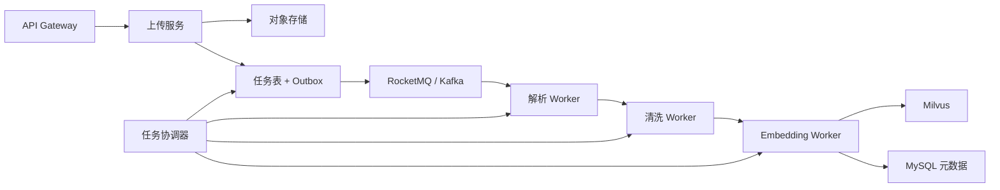

# 多格式批量知识导入设计

## 目标

导入链路面向知识运营人员，要求可观察、可恢复、可审核。系统不把“上传成功”等同于“知识生效”，每个文件必须经过解析、校验、索引、人工确认和审核。

## 支持格式

| 类型 | 格式 | 解析策略 |
| --- | --- | --- |
| Word | `.doc` `.docx` | Apache Tika / Apache POI |
| PDF | `.pdf` | PDFBox 文本层，扫描页自动 OCR |
| Excel | `.xls` `.xlsx` | 按工作表与单元格顺序提取 |
| PowerPoint | `.ppt` `.pptx` | 提取标题、正文、表格与备注文本 |
| 文本 | `.txt` `.md` `.csv` `.tsv` `.rtf` | 编码检测后提取 |
| 图片 | `.png` `.jpg` `.jpeg` `.tif` `.tiff` `.bmp` `.webp` | Tesseract `chi_sim+eng` OCR |

## 状态模型

批次状态：

- `QUEUED`：文件已安全落盘，等待工作线程领取。
- `PROCESSING`：至少一个文件正在处理。
- `READY`：全部文件已生成知识草稿，等待人工确认。
- `PARTIAL_READY`：部分成功、部分失败；成功项仍可提交审核。
- `FAILED`：没有文件成功。
- `SUBMITTED`：成功项已统一提交审核。

文件状态：

1. `QUEUED`
2. `DETECTING`
3. `EXTRACTING`
4. `VALIDATING`
5. `INDEXING`
6. `READY`
7. `SUBMITTED`

任何阶段异常进入 `FAILED`，记录根因和重试次数。

## 处理步骤

### 1. 上传与落盘

- 单批最多 50 个文件，单请求最大 20 MB，可通过配置调整。
- 文件名进行路径归一化，阻断目录穿越。
- 扩展名白名单只作为第一层校验，实际格式由 Tika MIME Detector 判定。
- 原文件写入按批次隔离的目录，数据库只保存受控路径。

### 2. 内容提取

- `AutoDetectParser` 统一路由 Office、PDF、纯文本和图片解析器。
- PDF 使用 `OCR_STRATEGY.AUTO`：优先读取文本层，文本不足时执行 OCR。
- OCR 语言通过 `app.import.ocr-language` 配置，Docker 默认提供简体中文和英文。
- 设置最大提取字符数，避免异常文档造成内存无限增长。

### 3. 清洗与质量校验

- 统一换行、空白和 NUL 字符。
- 正文少于 20 字符判定为无有效内容。
- Unicode 替换字符比例过高判定为乱码。
- 图片未识别到文字时返回可操作错误，不产生空知识。

### 4. 切片与向量化

- 按中文和英文标点优先切分，默认目标长度 420 字符。
- 文档更新时先删除旧切片，再生成新切片，避免脏索引。
- 当前 `HashEmbeddingService` 用于零依赖演示；生产实现应替换为 Embedding API 和 Milvus。

### 5. 人工确认与审核

- 解析成功只生成 `DRAFT` 知识，不直接参与问答。
- 运营人员在批次详情查看字符数、文档 ID、错误和处理阶段。
- 批次确认后，所有成功项变为 `PENDING_REVIEW`。
- 审核通过后变为 `APPROVED`，检索服务只读取该状态。

### 6. 失败恢复

- 单文件捕获异常，不回滚同批其他文件。
- “重试失败项”只重置 `FAILED` 文件，不重复处理成功文件。
- CSV 报告包含批次、MIME、大小、状态、字符数、知识 ID、重试次数和错误原因。

## 千万级演进方案

关键机制：

- 使用文件内容哈希作为幂等键，避免重复知识。
- 大文件按页/工作表拆为子任务，限制单任务内存。
- Outbox 保证数据库任务与消息投递一致。
- Worker 使用租约、心跳、最大重试和死信队列。
- 向量写入按 `documentId + version + chunkIndex` 幂等更新。
- 批次指标进入 Prometheus，解析失败率和队列堆积触发告警。

## 安全清单

- 扩展名、MIME、文件头三重检测
- 文件大小、页数、压缩展开比与提取字符上限
- 杀毒扫描和解析沙箱
- 禁止宏执行、外部链接加载与嵌入对象执行
- 原文件访问鉴权、加密存储和生命周期清理
- PII 检测、敏感标签与审核审计日志
