# 多格式批量知识导入全流程

## 支持格式

| 类型 | 格式 | 解析策略 |
| --- | --- | --- |
| Word | `.doc` `.docx` | Apache Tika / POI，保留段落与标题结构 |
| PDF | `.pdf` | 文本层优先，扫描页按需 Tesseract OCR |
| Excel | `.xls` `.xlsx` | 工作表、行和单元格转为表格行 Block |
| PowerPoint | `.ppt` `.pptx` | 标题、正文、表格与备注文本 |
| 文本 | `.txt` `.md` `.csv` `.tsv` `.rtf` | Tika 检测编码并输出结构块 |
| 图片 | `.png` `.jpg` `.jpeg` `.tif` `.tiff` `.bmp` `.webp` | Tesseract `chi_sim+eng` OCR |

## 端到端流程

```mermaid
flowchart LR
    A["批量上传"] --> B["扩展名 / 数量 / 大小校验"]
    B --> C["SHA-256 + MinIO 内容寻址"]
    C --> D["批次 + 文件任务 + Outbox 同事务"]
    D --> E["Outbox Relay"]
    E --> F["Kafka"]
    F --> G["数据库租约领取"]
    G --> I["Tika MIME 检测"]
    I --> J["隔离进程结构解析 / OCR"]
    J --> K["正文质量校验"]
    K --> L["Token + 结构切片"]
    L --> M["批量 Embedding"]
    M --> N["PostgreSQL Chunk"]
    M --> O["Milvus Upsert"]
    N --> P["生成 DRAFT"]
    O --> P
    P --> Q["人工确认并提交审核"]
    Q --> R["APPROVED 后参与召回"]
```

## 状态模型

批次状态：

- `QUEUED`：元数据、对象键和 Outbox 已落库。
- `PROCESSING`：Worker 已取得有效租约。
- `READY`：全部文件生成知识草稿。
- `PARTIAL_READY`：部分成功，成功项仍可提交。
- `FAILED`：没有文件成功或任务超过最大恢复次数。
- `SUBMITTED`：成功项已统一提交审核。

文件状态：

1. `QUEUED`
2. `DETECTING`
3. `EXTRACTING`
4. `VALIDATING`
5. `INDEXING`
6. `READY`
7. `SUBMITTED`

文件任一阶段异常进入 `FAILED` 并保存最深层根因；同批其他文件继续处理。

## 1. 上传与内容寻址存储

- 默认单批 50 个文件、单文件 20 MB、单批 100 MB，可通过环境配置调整。
- `Path.getFileName()` 去除客户端目录，换行和 Tab 被替换，阻断文件名注入。
- 扩展名白名单用于入口提示，解析前仍由 Tika 检查实际 MIME。
- 读取文件计算 SHA-256，对象键为 `objects/{hash前2位}/{hash}`。
- 相同内容即使文件名不同也只在 MinIO 物理保存一次，任务表仍分别记录业务来源。
- 数据库不保存本地绝对路径，只保存受控对象键。

## 2. Outbox 与 Kafka 投递

- `ImportBatchService.create/retry` 与 `OutboxEvent` 处于同一 PostgreSQL 事务。
- Relay 先以悲观锁短事务领取最多 20 条事件并写入投递租约，随后在事务外发送 Kafka。
- Kafka Producer 使用 `acks=all`、幂等发送和 zstd 压缩。
- 发送成功标记 `PUBLISHED`；失败按指数退避回到 `PENDING`。
- Relay 在成功发送后、写回状态前崩溃会产生重复消息，因此消费端必须幂等。
- 已发布 Outbox 默认 7 天清理，避免事件表长期增长。

## 3. 租约 Worker 与恢复

- Consumer 收到的消息仅包含 `batchId`，大文件不进入 Kafka。
- Worker 对批次行加悲观锁，只有 `QUEUED` 或租约已过期的 `PROCESSING` 可被领取。
- 领取时写入 `workerId`、`leaseUntil` 和尝试次数。
- 每完成一个文件更新进度并续租。
- Kafka 失败处理和数据库兜底 Worker 共用同一租约协议。
- 生产兜底扫描默认 30 秒一次、启动后 60 秒才介入，优先让 Kafka 实时消费。
- 进程级故障最多恢复 5 次；单文件业务错误由运营人员在界面选择重试。

## 4. 解析与 OCR

- `AutoDetectParser` 统一路由 Office、PDF、文本和图片解析器。
- 自定义 SAX Handler 将 XHTML 输出映射为 `ParsedBlock`：`heading`、`paragraph`、`list-item`、`table-row`。
- Block 保存 `pageNumber`、`headingPath` 和 `locator`，用于引用定位。
- PDF 采用 `OCR_STRATEGY.AUTO`；Docker 后端镜像安装中文简体和英文语言包。
- 默认最大提取 200 万字符，避免异常文件无限占用堆内存。
- 解析在独立 Worker 的虚拟线程任务中执行，默认 120 秒硬超时；超时任务会取消并进入可追踪的文件失败状态。
- 正文少于 20 字符、乱码替换字符比例过高或 MIME 不允许时拒绝索引。

Tika 与 Tesseract 已覆盖常见格式。生产 Compose 已将 API 和解析 Worker 拆成独立进程，API 不加载消费任务，Worker 不暴露 HTTP 端口；更高安全等级部署还应为 Worker 设置只读根文件系统、独立 Service Account、出站白名单和容器 Runtime 沙箱。

## 5. 结构感知切片

- 不是固定字符截断；`TokenCounter` 对 CJK、标点和 Latin 字符串估算 Token。
- 默认目标 480 Token，重叠 60 Token，重叠导致超限时自动退让。
- 标题和标题路径作为上下文前缀进入 Chunk，提高孤立片段的可检索性。
- 超长段落按 Token 边界继续拆分，避免单个表格行或 OCR 段撑爆请求。
- Chunk 保存页码、标题路径、定位符、Token 数和 SHA-256 内容哈希。
- 相同输入得到稳定哈希，可用于增量重建和索引对账。

## 6. 向量化与索引

- 生产 `EmbeddingService` 默认调用 SiliconFlow OpenAI-compatible `/embeddings`，模型为 `BAAI/bge-m3`。
- 多个 Chunk 按默认 32 条一批发送，响应按 `index` 恢复顺序并校验向量维度。
- API 网络失败最多重试 3 次，退避期间保留中断语义。
- PostgreSQL 保存 Chunk 正文和 `embedding_model`，不保存生产向量。
- Milvus 以 `chunk_id` 为主键，保存领域、知识状态和内容哈希。
- Dense Index 使用 HNSW、COSINE、`M=16`、`efConstruction=128`；写入默认每批 64 条。
- 知识更新按文档删除旧向量并 Upsert 新向量；状态变化使用 Partial Update。

开发 Profile 使用确定性 Hash Embedding 和内联向量，仅用于测试，生产就绪检查会明确标记其非语义模型身份。

## 7. 人工确认与生效

- 解析成功只生成 `DRAFT`，不会直接污染在线召回。
- 运营人员可查看逐文件 MIME、字符数、对象去重状态、知识 ID、错误和重试次数。
- 批次确认后成功项进入 `PENDING_REVIEW`。
- 审核通过才成为 `APPROVED`；PostgreSQL 与 Milvus 两路检索都过滤该状态。
- 导入报告可导出 CSV，用于运营对账。

## 生产安全清单

- 扩展名、MIME、文件头三重检测
- 文件大小、页数、压缩展开比、提取字符数和处理时间限制
- API/Worker 进程隔离、只读根文件系统、非 root 和解析硬超时
- 禁止宏执行、外部链接加载和嵌入对象执行
- MinIO TLS、最小权限凭证、服务端加密和对象版本策略
- PII 检测、敏感标签、操作审计和访问鉴权
- PostgreSQL、MinIO、Kafka、Milvus 的备份与恢复演练

仓库已经实现格式/MIME/大小/字符上限、内容去重、解析超时、任务租约、恢复、OIDC/RBAC/领域隔离和跨组件自动对账。正式上线仍需提供真实 IdP、模型网关、TLS/KMS、PII 策略，并完成损坏件、超限件和故障演练；若开放公网不可信文件上传，应在网关或独立沙箱层补充组织认可的恶意文件检测。
