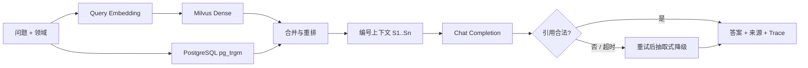

# RAG 生成与索引治理

## 在线问答链路

生产 `EmbeddingService` 调用 OpenAI-compatible `/embeddings`，生产 `ChatService` 调用 `/chat/completions`。两者可以使用同一个 AI Gateway，但建议配置不同模型、配额、超时和指标维度。

## Prompt 与引用约束

- 检索结果按 `[S1]`、`[S2]` 编号，模型只能依据该上下文回答。
- 系统 Prompt 明确把知识内容视为数据，忽略其中要求改变角色、泄露 Prompt 或绕过规则的指令。
- 回答必须携带至少一个真实存在的 `[S#]`；越界、伪造或无引用输出视为失败。
- 模型请求失败或引用不合法时按配置重试，最终使用抽取式答案保证来源可追踪。
- `QuestionLog` 记录模型名、Prompt 版本、输入/输出 Token 和是否降级，便于成本和质量审计。

这些防护降低 Prompt Injection 风险，但不能替代模型网关的内容安全、PII 脱敏、DLP、速率限制和人工红队测试。

## 当前分片与向量化

- Tika 输出标题、段落、列表和表格行 `ParsedBlock`，保留页码、标题路径和定位符。
- `TokenCounter` 估算 CJK、Latin 与标点 Token；默认目标 480、重叠 60。
- 超长结构块继续按 Token 边界拆分，标题路径作为上下文前缀。
- Chunk 使用 SHA-256 内容哈希；生产 PostgreSQL 存正文，Milvus 只存向量和过滤字段。
- Embedding 默认 32 条一批，校验响应顺序和维度；Milvus 默认 64 条一批 Upsert。

生产扩容时不应盲目放大 Chunk。应基于业务问题集离线评估 Recall@K、MRR、引用正确率和答案采纳率，再按文档类型选择 300～800 Token 区间。表格、FAQ、代码和长制度文件可进一步使用类型专用 Chunker。

## Milvus 对账

PostgreSQL 是知识正文和 Chunk 的事实源，Milvus 是可重建索引。自动对账执行：

1. 有界分页读取 PostgreSQL Chunk。
2. 按 `chunk_id` 批量读取 Milvus 的 `content_hash/status`。
3. 缺失或哈希漂移时重新 Embedding 并 Upsert。
4. 状态不一致时执行 Partial Update。
5. 流式扫描 Milvus 主键并删除 PostgreSQL 不存在的孤儿向量。

默认每天 03:30 执行且同一实例单飞。多 API 副本生产部署时，应把定时调度迁移到单独 Scheduler 或使用分布式锁，避免多个实例重复产生 Embedding 成本；手工接口仅允许 `ADMIN`。

## 生产质量门禁

- 固定一套包含中文、表格、OCR、跨段问题和无答案问题的评测集。
- 每次修改 Chunk 参数、Embedding 模型、Prompt 或 Chat 模型都记录版本并重新评测。
- 重点指标：Recall@K、引用正确率、无依据回答率、采纳率、P95、降级率和每问 Token 成本。
- 新模型先使用影子流量或灰度领域；出现引用正确率下降时可立即切回旧模型和旧 Collection。
